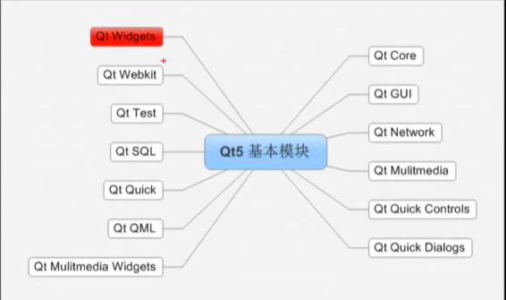

Qwidget 基础窗口类：所有窗口，或者控件的父类，QApplication\QDalog都继承自它


main：



表示窗口的一般都会继承自QObject  


使用对象树：（更方便内存管理）

当窗口构造为对象树的结构时，父对象在释放析构的时候，会自动释放子对象 

创建对象的方式基本上使用new来进行，


信号和槽机制：

信号：各种事件

槽：响应信号的动作


自定义信号

一些规矩：

1. 声明在类头文件的signals域下面
2. void类型的函数，没有返回值
3. 可以有参数，也可以重载
4. 只有声明，没有实现（qt在编译阶段自己添加）
5. 触发信号emit boj->sign(参数。。。)

自定义槽：

1. qt5可以声明在类的任何位置，还可以时静态成员函数、全局函数、lambda表达式
2. void类型的函数，没有返回值
3. 可以有参数，也可以重载
4. 不仅有声明，还得有实现

信号槽扩展：

1. 一个信号可以连接多个槽
   1. 一个信号建立了多个connect，当发生信号发射时，槽函数的调用顺序时随机的
2. 一个槽可以了解多个信号
3. 信号可以连接信号
   1. connect（第一个信号发送者，第一个信号，第二个信号发送者，第二个信号）
4. 信号和槽的参数关系必须满足以下两点
   1. 信号和槽函数的参数类型必须对应
   2. 信号和槽函数的参数个数不需要一致，信号函数参数个数>=槽函数参数个数
      1. hungry(QString)		->		treat()		ok
      2. hungry(QString)        ->		treat(int)    编译出错
5. QTDebug:
   1. QTDebug默认将QString转义输出
   2. 解决方法：
      1. 将QString转成char*

Lambda表达式（匿名函数对象）：

推荐使用形式`[=]() {}`

1. 

```c
int a;
int b;
// 默认传递（传递捕获）参数为const：
[a, b]()
{
    qDebug() << "hello lamabda" << Qt::endl;
    qDebug() << a * b;
};
// = 局部变量全部使用值传递捕获，捕获局部变量包括this
// & 局部变量全部使用应用传递捕获进来
// [=, b]() // 除b为捕获传递，其他都是。。。
// [&a, b]()

```

2. 需要修改值的话，传递捕获中需要&
3. 选项Opt
   1. 常用的是使用mutable声明，可以达到允许修改，值传递的拷贝效果
   2. 

Lamabda在信号和槽中的应用：

```c++
connect(pBnt, &QPushButton::clicked, [=]() {
    qDebug() << a * b << Qt::endl;
});
```

总结：信号和槽：去网上找。。。。。 

ui文件使用

1. 右上角对象树：
   1. 对象的归属
2. 右下角的属性和值：
   1. 继承关系
3. 在MainWindow中需要在ui->setupUi(this)也就是ui文件的初始化
4. 后续若需要使用ui里边的对象，直接使用ui->对象名 来获取窗口指针

资源文件使用：

1. 添加前缀，方便去管理资源


对话框:没有最大化，最小化的窗口


模态对话框 

QDialog

.exec()：消息循环，模态对话框

.show()：立即展示，非模态对话框


系统标准对话框：

QMessageBox 用来提示用户某条信息，分为以下几个级别，都可以通过QMessageBox::函数名的方式来调用，产生**模态**的对话框，若不想是模态：new+show  

1. info
2. warning
3. critical
4. question:可以获取用户获取了哪个对话框

 


标准文件对话框:QFileDialog

1. 使用QFileDialog打开一个文件对话框

2. 常用函数：

   1. getOpenFileName：打开的单一文件

      1. 可以指定文件默认路径

      2. 可以指定指定文件过滤器，格式：类型名称 （ *.cpp ....）;; 第二个....

      3. ```cpp
         QString fileName = QFileDialog:: (
                     this, "打开一个文件",
                     "E:\\Desktop\\CodeLIb\\qt\\09_dialog",
                     "PNG (*.png) ;; JPG (*.jpg) ;; C++ (*.cpp)");
         ```


### 布局

静态布局：位置大小不变

动态布局：点击父页面，设置垂直、水平、栅格、表单等等

弹簧设置sizeType为固定

各种常用控件

多选按钮：

1. 属性栏选项：tristate：是否使能三态（连续点击两次才算选中）

**listWidget**：

使用addItems添加大量列表

```c++
QStringList list;
list << "窗前明月光" << "疑是地上霜" << "举头望明月" << "低头思故乡";
ui->listWidget->addItems(list);
```

**treeWidget**

使用方式：

1. 设置标题，生成多少列
2. 添加根节点 treeWidget->addTopLevelItem
3. 根节点下添加字节点 item->addChild

**tableWidget**

1. 设置行数、列数 setRowCount setColumnCount

2. 设置水平的标题 setHorizontalHeaderLabels

3. 设置表格某行某列的数据

   ```c++
   setItem(cnt, 2, new QTableWidgetItem(QString::number(cnt + 18)));
   ```


**容器**

stacked Widget 页面的切换需要自己实现，一般使用按钮点击的时候切换

​	setCurrentIndex方式切换到第几页，序号从0开始 

Frame：形式和普通没啥区别，但是可以设置显示效果


**InputWidgets，输入窗口**

ComboBox：下拉框

FontComboBox：文字格式选择框

文本编辑。。。。

点击计数器。。

时间编辑。。。

日期编辑。。。

Dial：类似滚轮调节旋钮

label控件：

 1. 显示文件

 2. 显示动图等

    	1. ```c++
        QMovie *movie = new QMovie(":/down-arrow.gif", QByteArray(), this);
        ui->label_2->setMovie(movie);
        movie->start(); 
        ```

**自定义控件**

1. 新建界面设计类
2. 在主界面拖入自定义控件的父类
3. 右击变更为子类控件（提升），注意名称和新建控件的类名相同

**事件**

例子：

1. 鼠标点击，产生事件，包含：点击哪个键，坐标的信息
2. 系统收到事件并抛出
3. 各种处理函数 

流程：

1. 新建label类
2. ui中提升label
3. 重写鼠标事件函数
4. 获取事件信息

发生某个事件时，事件会到达窗口的event函数，

若返回true，表示该事件的到处理，如果是false，事件会继续传递到父窗口

通过判断QEvent参数类型，调用响应的处理函数


若不是需要筛选的事件则调用父类的event

QLabel::event(e);

**事件过滤器**

。。。。。。


**定时器事件**

```c++
void Widget::timerEvent(QTimerEvent *event)
{
    static int num1;
    static int num2;
    if(event->timerId()==this->mTimeId1) {
        num1++;
        ui->lcdNumber->display(num1);
    }
    if(event->timerId()==this->mTimeId2) {
        num2++;
        ui->lcdNumber_2->display(num2);
    }

}


void Widget::on_pushButton_clicked()
{
    // 先释放
    if(!this->mTimeId1) {
        killTimer(this->mTimeId1);
    }
    this->mTimeId1 = startTimer(1000);
}


void Widget::on_pushButton_2_clicked()
{
    // 停止定时器
    killTimer(this->mTimeId1);
}


void Widget::on_pushButton_3_clicked()
{
    // 先释放
    if(!this->mTimeId2) {
        killTimer(this->mTimeId2);
    }
    this->mTimeId2 = startTimer(100);

}


void Widget::on_pushButton_4_clicked()
{
    killTimer(this->mTimeId2);
}
```

**另一种定时器，分装好的**

ClientCharacteristicConfiguration

